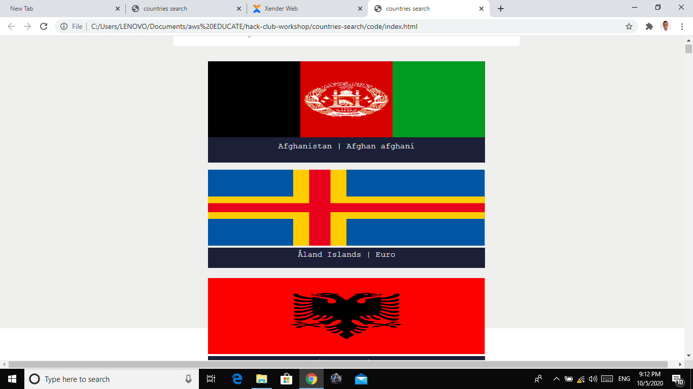

# Country List



This is the [Live Demo](https://codepen.io/Taiwrash/countries-list-app/run) of the app and [Full Code](https://codepen.io/Taiwrash/countries-list-app).

_We recomend any browser and good network and or internet access._

In this workshop we will be using the [restcoutries.eu](https://restcountries.eu/rest/v2/all) rest API to fetch all the flags and the countries name using vanilla javascript. API is an acronym of Application Programming Interface (API) which gives quick access to web app development. A web app is a webpage that is dynamic.

### The Features/Sections Are

- Flag Section
- Country Name Section

# Mark Up Section (Setting up the html)

We will be using very simple and easy to understand html elements as display below and also our `css` and `script` files will be linked externally

```<!DOCTYPE html>
<html lang="en">
  <head>
    <meta charset="UTF-8" />
    <meta name="viewport" content="width=device-width, initial-scale=1.0" />
    <title>countries search</title>
    <link rel="stylesheet" href="style.css" />
  </head>
  <body>
    <main id="main">
      <div class="card"></div>
    </main>
    <script src="script.js"></script>
  </body>
</html>
```

**NOTE:** Never copy paste a non clear code or the code you did not understand. A brief explanation of the html boilerplate at the top is as simple as having `css` file linked at he `head` section of the html and the main element for the purpose of sematic and web page accessibilties. Followed by a div with a class attribute of card which shall hold every country flags and names and lastly linked with a javascript `script` file that will do all the magic, just before closing the body tag.

# The StyleSheet

- Clearing Default Style

```* {
  margin: 0;
  padding: 0;
  box-sizing: border-box;
}
```

This is purposely to remove the default margin and padding of every element and to set the box-sizing to border-box which controls misbehaviour activities of every elements on the page.

- Styling Main Content area

```main {
  width: 100vw;
  height: 100vh;
  background-color: #efefee;
  display: flex;
  flex-direction: column;
  align-items: center;
  padding-top: 50px;
}
```

Both the width and height are set to the view width and view height of the viewing device. It is display flex (Flex is a new feature in css that encourage and improve responsiveness of every web pages) you can read more at [CSS Flex](https://flex.io)

- Styling the Card

```.card {
  width: 40%;
  height: 200px;
  background-color: #1d1f38;
}
```

This will take 40% of the main content area that is the 40% of 100vw and a height of 200px

- Styling the flag size

```img {
  width: 100%;
  height: 150px;
}
```

Given width and height to the flag size. 100% of the card size.

- Styling the country names

```p {
  width: 100%;
  height: 40px;
  background-color: #1d1f38;
  color: #efefee;
  text-align: center;
  font-family: "Courier New", Courier, monospace;
  padding: 5px;
  margin-bottom: 20px;
}
```

The font size and type are set and spacing were set using padding and margin

# The Script part and the magic section

```window.addEventListener("load", (e) => {
  const main = document.getElementById("main");
  const card = document.querySelector(".card");
  const cardParent = document.createElement("div");

  const API = `https://restcountries.eu/rest/v2/all`;
  fetch(API)
    .then((res) => {
      return res.json();
    })
    .then((data) => {
      let item;
      for (let i = 0; i < data.length; i++) {
        item = data[i];

        const el = document.createElement("img");
        el.setAttribute(
          "src",
          `https://restcountries.eu/data/${item.alpha3Code.toLowerCase()}.svg`
        );

        const el1 = document.createElement("p");
        el1.textContent = item.name

        cardParent.appendChild(el);
        cardParent.appendChild(el1);
      }
```

As the window loads a fuction get called, where main, card and cardParent are set for DOM manipulation. API variable was created to keep and save the base url gotten from [restcountries.eu](https://restcountries.eu/rest/v2/all). Then javascript fetch method was invoked with the argument/parameters of base url. The response was converted to json through the first promise returned. The last promised return data from the url and the data was loop through.

```const el = document.createElement("img");
        el.setAttribute(
          "src",
          `https://restcountries.eu/data/${item.alpha3Code.toLowerCase()}.svg`
        );

        const el1 = document.createElement("p");
        el1.textContent = item.name + " | " + item.currencies[0].name;

        cardParent.appendChild(el);
        cardParent.appendChild(el1);
```

Inside the loop el which is the image of the flag and el1 which was the paragraph element for the name was created using javascript DOM method. The textContent was used to put in the text from the API to the <p> tag of created with DOM. both are append into cardParent and later append and render out in the card element

other live demo and extension.
[Abdulqudus](codepen.io)
[day16](Taiwrash.github.io/30daysOfCode/day16)
[leom](repl.it)
